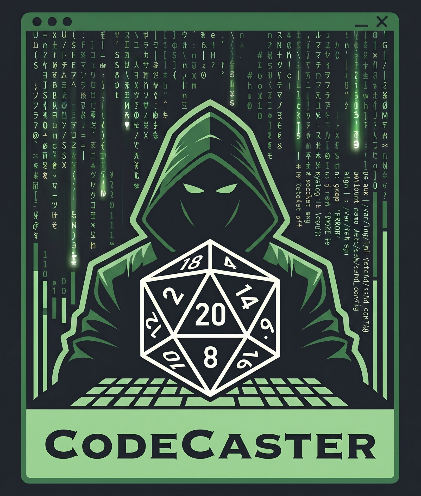

<div align="center">



# CodeCasters

**soluciones limpias, eficientes y escalables**

_Ingenieros de la Universidad Tecnológica de Hermosillo_


[](www.ko-fi.com/codecasters)


</div>

---

## ¿Quiénes somos?

CodeCasters es un equipo de desarrollo de software especializado en aplicaciones web modernas. Priorizamos código limpio, arquitecturas mantenibles y soluciones eficientes adaptadas a cada problema. Aunque nuestro fuerte es el desarrollo web, también construimos aplicaciones de escritorio, móviles y herramientas de propósito general cuando el proyecto lo requiere.

---

## Filosofía de trabajo

- **Código limpio sobre código rápido** — escribimos pensando en quien lo lee después.
- **Soluciones al problema real** — nada de over-engineering innecesario.
- **Colaboración abierta** — revisamos, comentamos y aprendemos en equipo.
- **Tecnología al servicio del producto** — elegimos el stack que mejor resuelve, no el más de moda.

---

## ¿Qué entregamos?
- **Gestión ágil** — Seguimiento mediante tableros Kanban (GitHub Projects) y entregas incrementales.
- **Documentación técnica completa** — Diagramas de arquitectura, DER y documentación de API (Swagger/OpenAPI).
- **Código fuente auditable** — Repositorios organizados, con historial de commits limpio y semántico.
- **Garantía de calidad** — Software testeado y listo para producción, no solo "código que funciona".

---

## Stack web principal

| Área              | Tecnologías                                        |
| ----------------- | -------------------------------------------------- |
| **Frontend**      | React, TypeScript, Vite, Next.js, Tailwind CSS     |
| **Backend**       | NestJS, Node.js, TypeScript                        |
| **Bases de datos**| PostgreSQL, Supabase, Prisma ORM, MongoDb          |
| **Auth & Storage**| Supabase Auth, JWT                                 |
| **Testing**       | Jest, Vitest, Playwright, Testing Library          |
| **DevOps / CI**   | Git, GitHub Actions, ESLint, Prettier              |
| **Despliege**     | Vercel, Railway, Docker, VPS (Linux/Ubuntu/Arch)   |

---

## Equipo

| Integrante | Rol | Enfoque |
| ------------------------------------ | -------------------- | ------------------------------------------ |
| **Sadrach Juan Diego Garcia Flores** | Fullstack — Líder general y de backend | Arquitectura, API, lógica de negocio, integración, Linux Ops, etc |
| **Adrian Eduardo Santos Rosales** | Frontend — Líder de frontend | UI/UX, componentes, Vistas, etc |
| **Jesus Adriana Martinez Trillas** | Frontend | Vistas, integración con API, testing de UI, etc |
| **Erick Daniel Arvayo Aviles** | Backend | Servicios, lógica de negocio, base de datos, validaciones, etc |

---

## Estructura de proyectos

Nuestros repositorios siguen una estructura consistente para mono repo (usamos 2 repos en casi todos los casos):

```
proyecto/
├── docs/               # Documentación técnica
├── api/                # Backend — NestJS + Prisma
│   ├── src/
│   │   ├── modules/    # Módulos por dominio
│   │   └── common/     # Guards, interceptores, DTOs compartidos
│   └── prisma/
│       └── schema.prisma
│
├── web/                # Frontend — React + Vite
│   ├── src/
│   │   ├── pages/
│   │   ├── components/
│   │   ├── services/
│   │   └── lib/
│   └── e2e/
│
└── README.md
```

---

## Estándares de calidad

- Tipado estricto con TypeScript en todo el stack.
- DTOs validados con `class-validator`; sin datos sin validar llegando al core.
- Tests unitarios y E2E en cada proyecto antes de merge a `main`.
- Pipelines de CI (`lint → type-check → test → build`) automatizados.
- Revisión de código obligatoria entre pares antes de merge.
- Commits semánticos (`feat:`, `fix:`, `refactor:`, etc.).

---

## Seguridad

- JWT validado por guard en cada endpoint protegido.
- Control de acceso por roles en backend y frontend.
- Rate limiting en endpoints sensibles (autenticación, operaciones críticas).
- Variables de entorno nunca en el repositorio (`.env.example` como referencia).
- Headers de seguridad HTTP con Helmet en todos los servicios.
- Validación estricta de entrada con `whitelist: true`.

---

## Contacto

¿Tienes un proyecto o quieres colaborar?

> Equipo CodeCasters — Ingeniería en Tecnologías de la Información
> ContactUS: `jdiegodev0805+contactus@gmail.com`

---

<div align="center">

_CodeCasters — código con propósito._

</div>
